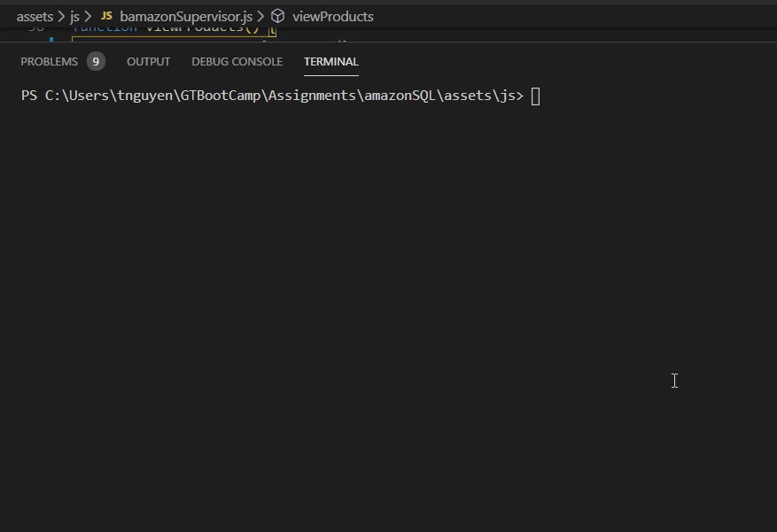
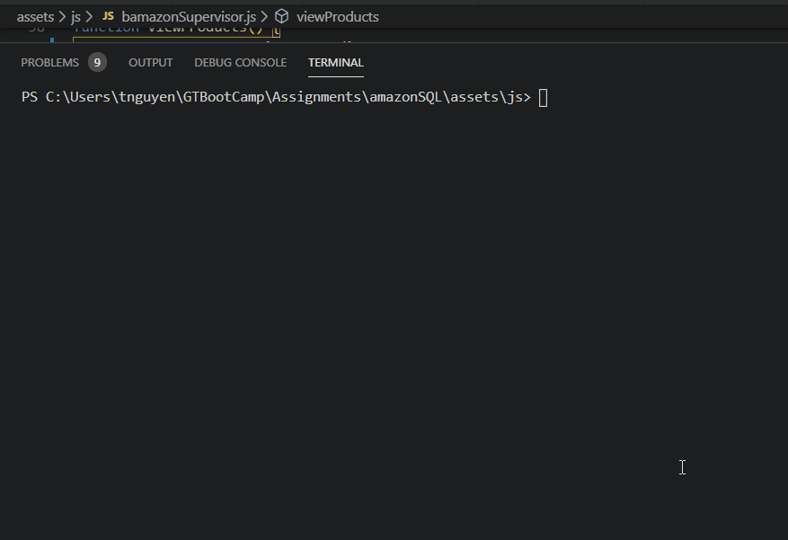
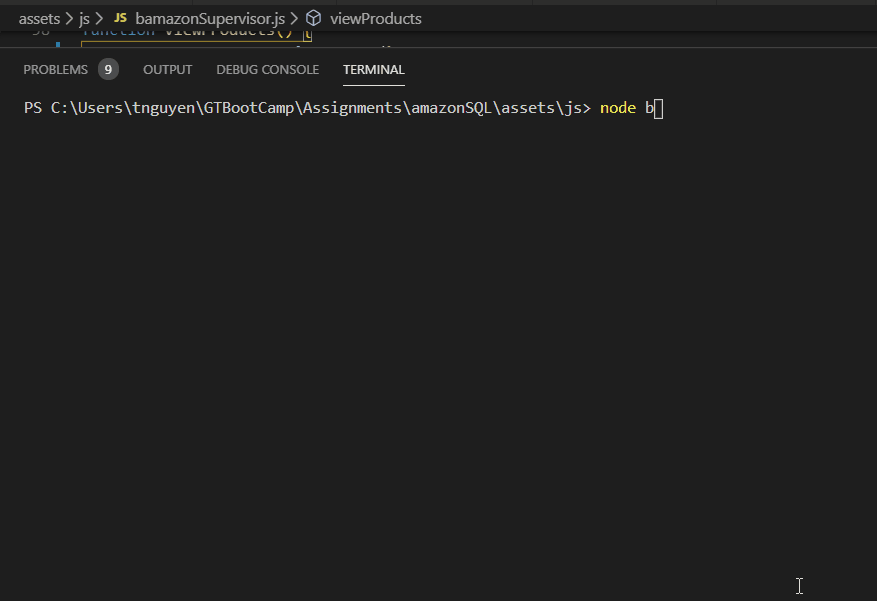
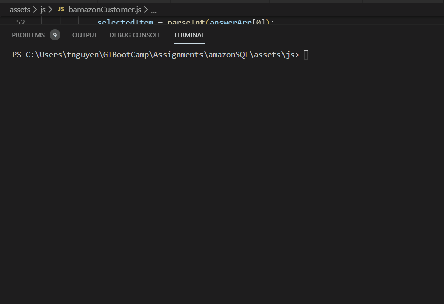
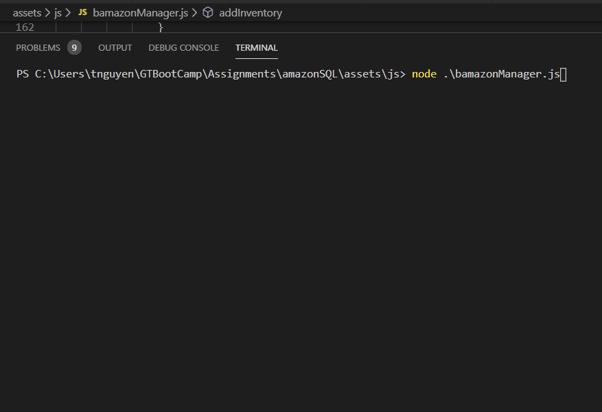
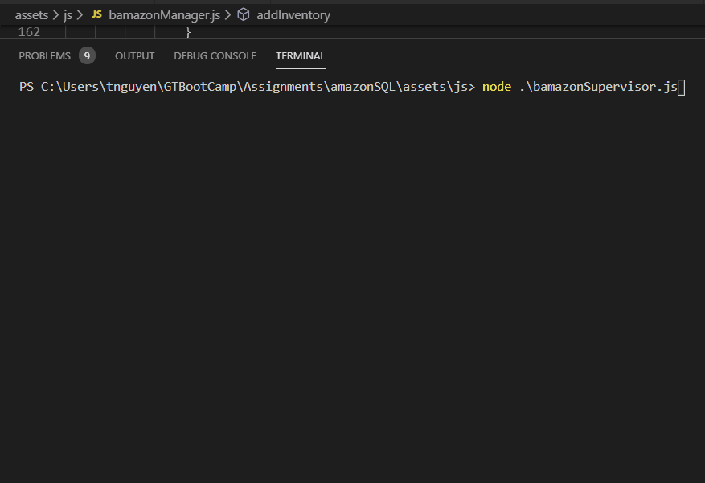
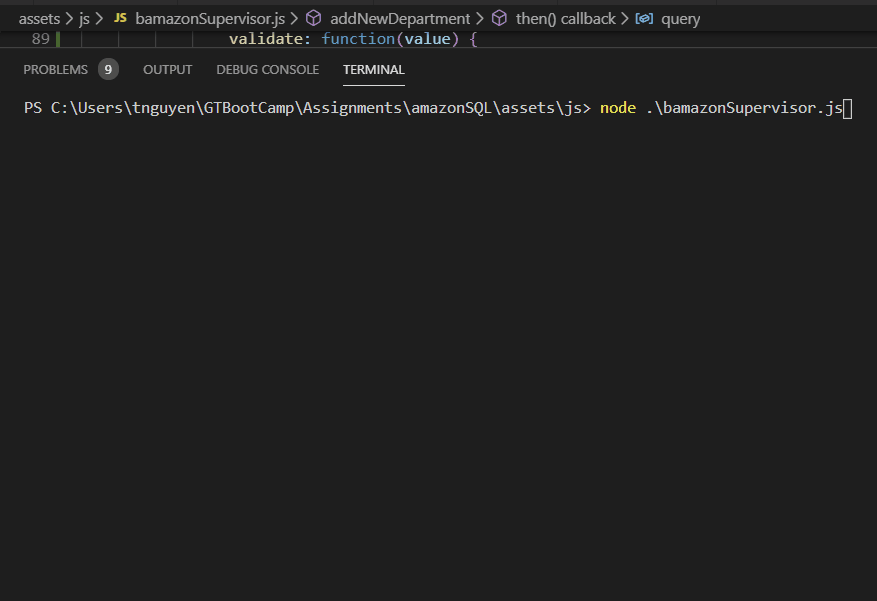

# Amazon-Like SQL
[](LICENSE)


## What is this repo?
This app is an imitator of Amazon SQL. The purpose of this app is to provide the understanding of SQL with backend Node JS command line interface. With this app, the user can understand how to Create, Read, Update, and Delete (CRUD) database. It is a great learning tool for someone who is learning Javascript, NODE js and SQL.

## How is this repo useful?
This is a great learning tool for node js/javascript/SQL beginners to get acquainted with the following concepts:
  * Learn about dotenv to store API keys and keeping sensitive information private.
    * [dotenv package](https://www.npmjs.com/package/dotenv)
  * Learn about inquirer to prompt user and retrieve answer through CLI.
    * [inquirer package](https://www.npmjs.com/package/inquirer)
  * Learn about mysql driver in Node js. 
    * [mysql package](https://www.npmjs.com/package/mysql)
  * Learn about console.table, which provides table format when console to terminal.
    * [console.table package](https://www.npmjs.com/package/console.table)
  * The script is written in Node JS.
    * [Node JS](https://nodejs.org/en/)


## How to get Started?
* clone the repository:
```git
git clone git@github.com:tmnguyen8/amazonSQL.git
```
* If you node js and npm installed, you can skip this step.
  * [Downloading and installing Node.js and npm](https://docs.npmjs.com/downloading-and-installing-node-js-and-npm)

* Install the packages:
Navigate to your directory where this repo lives on your local machine and install the following packages:
```git
npm install --save dotenv
npm install --save inquirer
npm install --save mysql
npm install --save console.table
```
* Assigning Database Keys
1. In the same folder directory as the node js files, create a file named ```.env```, add the following to it, replacing the values with your API keys (no quotes) once you have them:
```git
# Database password

DB_HOST=localhost
DB_PORT=3306
DB_USER=<user>
DB_PASSWORD=<password>
DB_DATABASE_NAME=bamazon
```
## How does this work?
1. The Customer has the functionality of viewing the available items to be purchased. Upon running the bamazonCustomer.js file in node js, the user can select the item be purchase and the number of items to purchase. The program will execute and display the total amount to be paid. It will then update the stock quantity in the database.

 ```node bamazonCustomer.js```

 

2. The Manager has the functionality to do more with a list of menu options:

 ```node bamazonManager.js```

    * View Products for Sale

    * View Low Inventory

    * Add to Inventory

    * Add New Product
  
  
  
  

3. The Supervisot has the functionality to view the sale performance of all the departments. The list of menu options includes:

   * View Product Sales by Department
   * Create New Department

 ```node bamazonSupervisor.js```
  
  


## Contact

Visit my portfolio and contact page for any comments.
[https://tmnguyen8.github.io/portfolio/](https://tmnguyen8.github.io/portfolio/)


